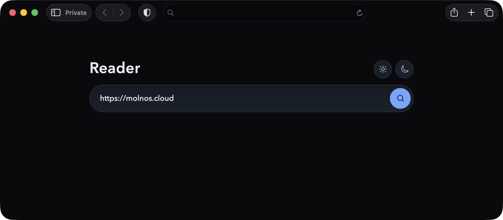
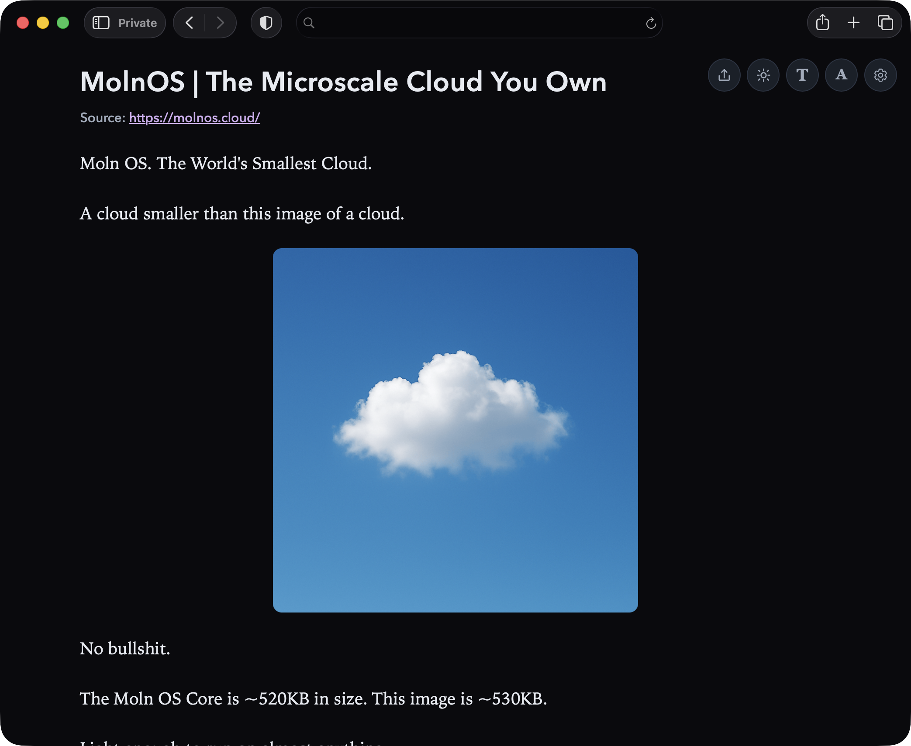

# Reader

**Reader-friendly Cloudflare Worker for safer, cleaner web reading.**

Reader is a clean, reader-friendly proxy for the modern web running on Cloudflare Worker. It fetches pages and renders them in a safer, cleaner format with script-heavy clutter removed. It supports both reader extraction mode and mirror mode (no JS), with a modern, mobile-friendly reading UI.


[](https://opensource.org/licenses/MIT)




## Features

- **Reader mode**: Extracts the core content from noisy pages
- **Mirror mode (no JS)**: Loads original page structure with scripts stripped
- **Safer rendering**: Strong CSP, sanitized markup, and blocked dangerous URL schemes
- **Mobile-friendly UI**: Flat, modern reading interface tuned for readability
- **Client-side controls**: Theme, font family, and text size toggles without page reload
- **Native sharing fallback**: Uses native share sheet when available, clipboard fallback otherwise
- **Cloudflare-native**: Runs at the edge on Cloudflare Workers

## Quick Start

### Local development

```bash
npm install
npm run dev
```

Then open Wrangler's local URL and use:

`/?url=https://example.com`

### Build

Builds a single, minified Worker bundle at `dist/worker.js`:

```bash
npm run build
```

This output is optimized for direct Cloudflare Worker usage (dashboard paste or `wrangler deploy`).

### Deploy

```bash
npm run deploy
```

## Download release

Download the latest release from:

- [GitHub Releases](https://github.com/mikaelvesavuori/reader/releases/latest)

Release assets include:

- `worker.js` — minified Worker bundle ready to deploy
- `reader_<version>.zip` — packaged release bundle
- SHA256 checksum files for verification

## Configuration

Primary options are query-based:

- `url` - target page URL to fetch and render
- `mode=reader|mirror` - extraction style
- `theme=light|dark` - initial theme preference

Runtime UI settings (font and text size) are stored locally in the browser.

## License

MIT. See the [LICENSE](LICENSE) file.
